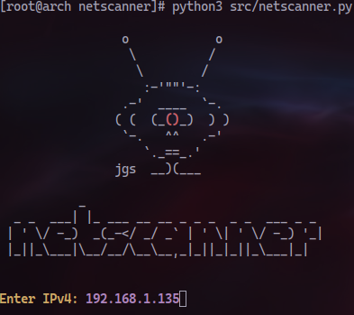

<p align=center>
  
</p>

## Installation

```bash
# clone the repo
git clone https://github.com/pablodorrio/netscanner

# change the working directory to netscanner
cd netscanner

# install the requirements
python3 -m pip install -r requirements.txt
```

## Usage

```bash
sudo python3 netscanner/src/netscanner.py
```

## Contributing

Pull requests are welcome. For major changes, please open an issue first
to discuss what you would like to change.